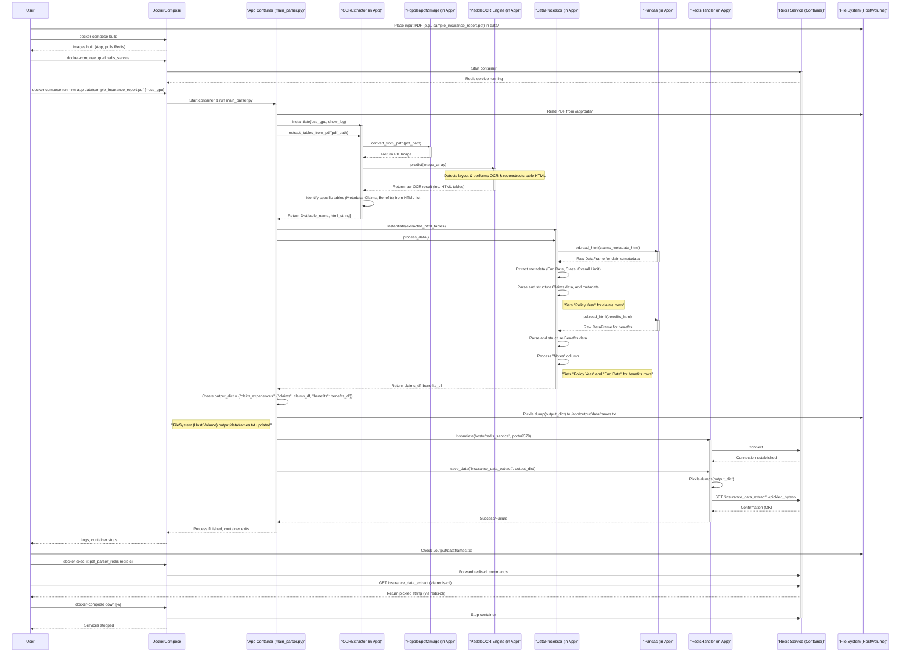
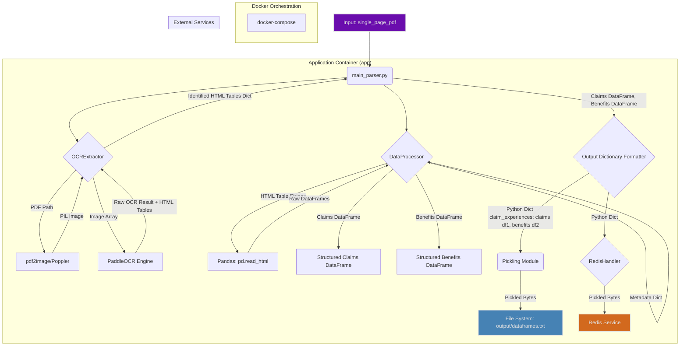

# PDF Table Data Extractor to Redis

## Objective

This project develops a Docker-based system to recognize tabulated text from a single-page PDF file and convert it into machine-readable text according to a given format. The extracted and processed data, specifically "Claims Experience" and "Benefits" information, is then saved into Redis and as a pickled Python dictionary.

## Features

*   **PDF Table Recognition:** Utilizes PaddleOCR (PP-StructureV3) for robust table detection and OCR from PDF documents.
*   **Structured Data Extraction:** Parses recognized tables into structured Pandas DataFrames for "Claims" and "Benefits" data.
*   **Format Adherence:** Ensures extracted data conforms to specified column structures, data types, and formatting rules (e.g., date formats, "Notes" column processing).
*   **Metadata Integration:** Extracts key metadata from the PDF (Policy End Date, Class, Overall Limit) and incorporates it into the relevant DataFrames.
*   **Pickled Output:** Saves the final DataFrames (Claims and Benefits) in a Python dictionary, which is then pickled to a file named `dataframes.txt`.
*   **Redis Integration:** Stores the same pickled dictionary structure in a Redis database.
*   **Dockerized Solution:** Fully containerized using Docker and Docker Compose for easy setup, portability, and deployment, including GPU support for accelerated OCR processing.

## Tech Stack

*   **Python 3.11**
*   **OCR:** PaddleOCR (specifically `paddlepaddle-gpu==3.0.0` or CPU equivalent)
*   **Data Handling:** Pandas
*   **Database:** Redis
*   **Containerization:** Docker, Docker Compose
*   **PDF Handling:** `pdf2image` (with Poppler)

## Project Structure

```
.
├── Dockerfile                 # Defines the application's Docker image
├── docker-compose.yml         # Defines services, networks, and volumes for Docker
├── requirements.txt           # Python package dependencies
├── README.md                  # This file
├── .gitignore                 # Specifies intentionally untracked files
├── data/
│   └── sample_insurance_report.pdf  # Placeholder for input PDF (user should provide)
├── output/                    # Directory for generated output files
│   ├── dataframes.txt         # Pickled output dictionary (Deliverable 6)
│   └── (debug_ocr/)           # Optional: Debug outputs from OCR extractor
│   └── (processed_data/)      # Optional: CSV outputs if testing data_processor directly
└── src/
    ├── __init__.py
    ├── main_parser.py       # Main script: orchestrates the PDF processing pipeline
    ├── ocr_extractor.py     # Handles PDF to HTML table extraction using PaddleOCR
    ├── data_processor.py    # Processes raw HTML tables into structured Pandas DataFrames
    └── redis_handler.py     # Manages Redis connection and data storage/retrieval
```

## Sequence Diagram



## Dataflow Diagram



## Setup & Installation (Docker)

1.  **Clone the Repository:**
    ```bash
    git clone <your-repository-url>
    cd <repository-name>
    ```

2.  **Place Input PDF:**
    Copy your single-page PDF file (e.g., `your_report.pdf`) into the `data/` directory. For example:
    ```bash
    cp /path/to/your_report.pdf data/sample_insurance_report.pdf
    ```
    *(The run commands below will assume the PDF in `data/` is named `sample_insurance_report.pdf`. Adjust if necessary.)*

3.  **Build Docker Images:**
    This command builds the application image defined in `Dockerfile` and pulls the Redis image.
    ```bash
    docker-compose build
    ```
    *(The first build, especially for the `app` service, might take some time as it downloads system dependencies and Python packages, including PaddleOCR models).*

## How to Run (Docker)

1.  **Start Redis Service:**
    It's recommended to start the Redis service in detached mode first.
    ```bash
    docker-compose up -d redis_service
    ```

2.  **Run the PDF Parser Application:**
    This command runs the main parsing script within a new container, which connects to the `redis_service`. Replace `data/sample_insurance_report.pdf` with the actual path to your PDF inside the container's `data` volume.

    *   **For CPU processing:**
        ```bash
        docker-compose run --rm app data/sample_insurance_report.pdf
        ```

    *   **For GPU processing (ensure prerequisites are met and `docker-compose.yml` is configured for GPU):**
        ```bash
        docker-compose run --rm app data/sample_insurance_report.pdf --use_gpu
        ```

3.  **Output:**
    *   **Pickle File:** The primary output `dataframes.txt` (containing the pickled dictionary of DataFrames) will be saved to the `./output/` directory on your host machine (due to volume mapping).
    *   **Console Logs:** The application will log its progress to the console.
    *   **Debug Files:** If enabled or part of the `ocr_extractor`, intermediate HTML files might appear in `./output/debug_ocr/`.

4.  **Verify Data in Redis:**
    You can connect to the Redis container to check if the data was saved:
    ```bash
    docker exec -it pdf_parser_redis redis-cli
    ```
    Inside the `redis-cli`:
    ```redis-cli
    GET insurance_data_extract
    ```
    This will display the raw pickled string. To properly inspect it, you would typically use a Python script with `pickle.loads()`. The application logs should indicate success or failure of Redis storage.

5.  **Stopping Services:**
    To stop the Redis service when you're done:
    ```bash
    docker-compose down
    ```
    If you want to remove volumes (including Redis data and model caches):
    ```bash
    docker-compose down -v
    ```

## Output Format

The solution produces the primary output in two forms:

1.  **Pickle File (`dataframes.txt`):**
    A Python dictionary is pickled to this file. The structure is:
    ```python
    {
        "claim_experiences": {
            "claims": claims_df,      # pandas.DataFrame for claims
            "benefits": benefits_df   # pandas.DataFrame for benefits
        }
    }
    ```

2.  **Redis:**
    The same dictionary structure is pickled and stored in Redis under the key `insurance_data_extract` (this key can be configured via command-line arguments to `main_parser.py`).

## Data Frame Specifications

*(As detailed in the task description, covering column names for Claims and Benefits DataFrames, data types, and specific processing rules for fields like "Notes" and "End Date").*

### Claims Data Frame Columns:
*   `Monthly claims`
*   `Number of insured lives`
*   `Number of claims`
*   `Amount of paid claims`
*   `Amount of paid claims (with VAT)`
*   `Policy Year` (e.g., "Last Policy Year", "Prior Policy Year", "2 years Prior")
*   `End date` (from metadata, format `yyyy-mm-dd`)
*   `Class` (from metadata)
*   `Overall Limit` (from metadata)

### Benefits Data Frame Columns:
*   `Benefit_Sama`
*   `Number of Claims`
*   `Amount of Claims`
*   `Amount of Claims with VAT`
*   `Notes` (Processed: "No info", "Paid X% up to Y", "yes"/"no" for cesarean)
*   `Policy Year` (e.g., "Last Policy Year")
*   `End date` (from metadata, format `yyyy-mm-dd`)


## Assumptions Made

*   The input PDF is a single page.
*   The general layout of the tables within the PDF is consistent with the provided sample document.
*   The "Overall Benefits" table consistently refers to the "Last Policy Year".
*   PaddleOCR models are downloaded automatically on the first run if not already cached in the Docker volume (`/root/.paddleocr`). This might make the first run slower.

## (Optional) Running Locally (for Development/Debugging)

While Docker is the primary method for running this application, local execution is possible for development:

1.  **System Dependencies:**
    *   Install Poppler for `pdf2image`. (e.g., `sudo apt-get install poppler-utils` on Debian/Ubuntu).
    *   Ensure other dependencies required by PaddleOCR are met for your OS.
2.  **Python Environment:**
    *   Create and activate a Python virtual environment (e.g., Python 3.11):
        ```bash
        python -m venv venv
        source venv/bin/activate  # On Linux/macOS
        # venv\Scripts\activate    # On Windows
        ```
    *   Install Python packages:
        ```bash
        pip install -r requirements.txt
        ```
3.  **Redis:** Ensure a Redis instance is running and accessible (e.g., `localhost:6379`).
4.  **Run:**
    Execute the main parser script:
    ```bash
    python -m src.main_parser data/sample_insurance_report.pdf --redis_host localhost --redis_port 6379
    ```
    Adjust paths and Redis connection details as necessary.

## Troubleshooting

*   **Slow First Run (Docker):** PaddleOCR downloads models on its first execution if they aren't cached. Subsequent runs using the cache volume (`paddleocr_cache`) will be faster.
*   **GPU Issues with Docker:** Ensure NVIDIA drivers and NVIDIA Container Toolkit are correctly installed and configured on your host. Verify the `deploy.resources.reservations.devices` section in `docker-compose.yml` is appropriate for your setup.
*   **Redis Connection Errors:** Double-check that the Redis service (`redis_service`) is running before the `app` service attempts to connect. Ensure hostnames and ports match between `docker-compose.yml` and the application's configuration (environment variables `REDIS_HOST`, `REDIS_PORT`).
*   **`pdf2image` Errors:** This usually indicates Poppler is not installed or not in the system's PATH (within the Docker container, `apt-get install poppler-utils` should handle this).